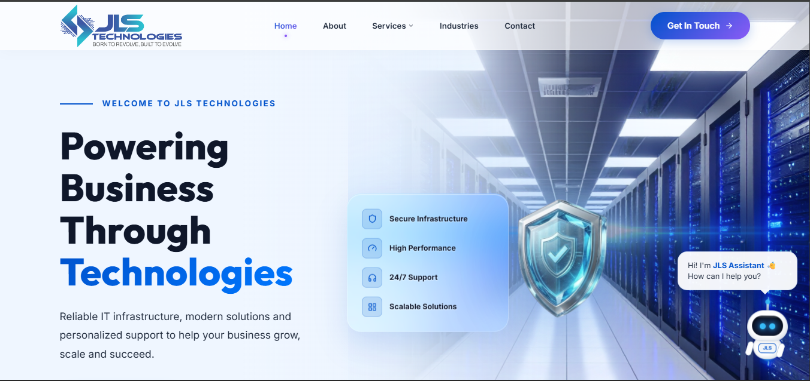
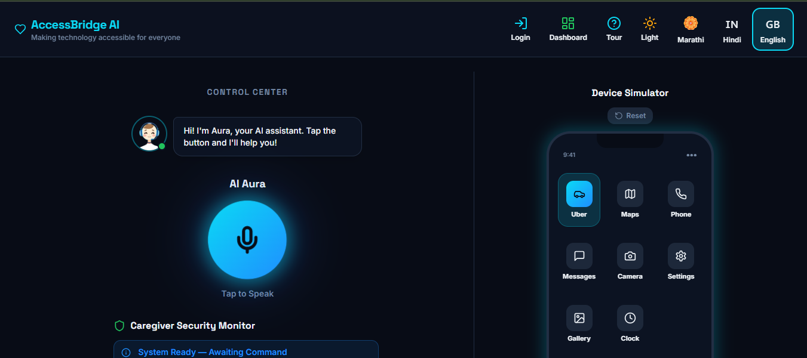
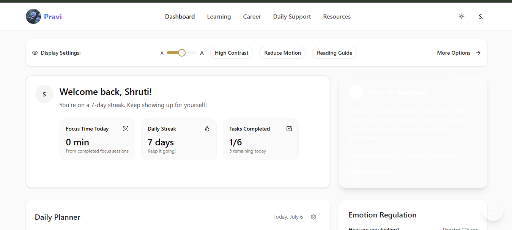
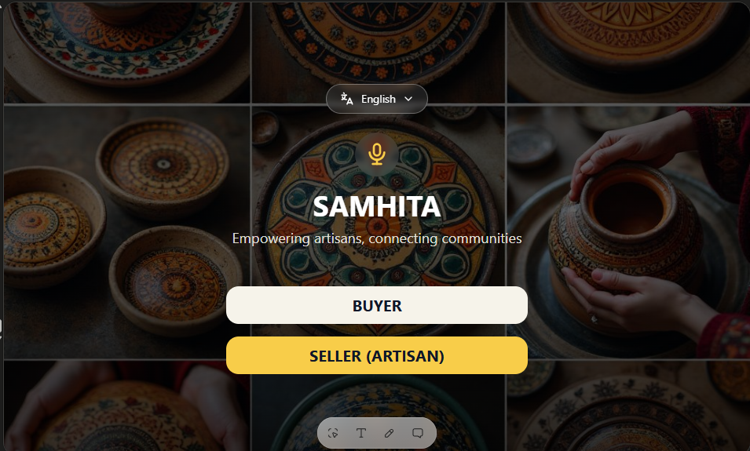
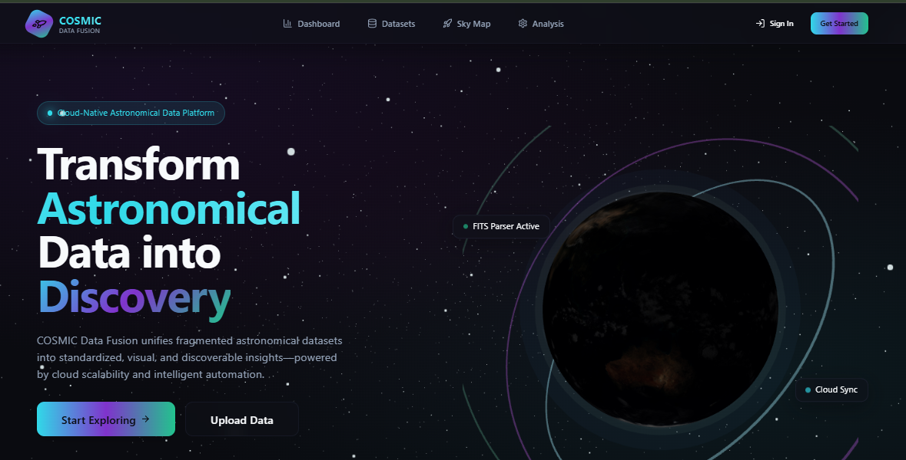

  

<h1 align="center">
Hi 👋 I'm Shruti Thakur
</h1>

<h3 align="center">
AI Engineer • Full Stack Developer • Cybersecurity Enthusiast
</h3>

---

# 💫 About Me

🎓 **B.E. Information Technology** @ APSIT

🎓 **IIT Madras BS** in Data Science & Applications

💜 Passionate about building AI-powered solutions that solve real-world problems.

🚀 Building full-stack applications with a focus on accessibility, AI, and cloud technologies.

🌱 Currently exploring **Agentic AI**, **Cybersecurity**, and **AWS Cloud**.

🎯 **Mission:** Build technology that creates meaningful real-world impact.

☕ Fun fact: Curiosity doesn't kill the cat—it builds the engineer.

---
# 🛠 Tech Stack

<table>

<tr>

<td width="33%" valign="top">

<h3 align="center">🎨 Frontend</h3>

 

 

</td>

<td width="33%" valign="top">

<h3 align="center">⚙️ Backend & Database</h3>

 

 

</td>

<td width="33%" valign="top">

<h3 align="center">🤖 AI & Cloud</h3>

 

</td>

</tr>

<tr>

<td width="33%" valign="top">

<h3 align="center">💻 Languages</h3>

 

</td>

<td width="33%" valign="top">

<h3 align="center">🛠 Dev Tools</h3>

 

</td>

<td width="33%" valign="top">

<h3 align="center">☁️ Deployment</h3>

 

 

</td>

</tr>

</table>

---

# 🚀 Featured Projects

<table>
<tr>

<td width="50%" valign="top">

<h3 align="center">🌐 JLS Technologies</h3>

Production-ready corporate website for an IT Infrastructure & Technology Solutions company, focused on modern UI, performance, and accessibility.

`TanStack` • `Cloudflare`

</td>

<td width="50%" valign="top">

<h3 align="center">🤖 AccessBridge AI</h3>

AWS AI for Bharat Hackathon

AI-powered multilingual digital assistant leveraging AWS AI services to simplify digital service access through voice automation and accessibility-first design.

🏆 Prototype Development Phase

`Amazon Bedrock` • `Bhashini`

</td>

</tr>

<tr>

<td width="50%" valign="top">

<h3 align="center">🧠 Pravi</h3>

Google Solution Challenge

AI-powered accessibility platform empowering neurodiverse users through voice-enabled interactions and intelligent assistance.

`Gemini AI`

</td>

<td width="50%" valign="top">

<h3 align="center">🛍 Samhita</h3>

Google Gen AI Exchange Hackathon

AI-powered marketplace assistant connecting local artisans with customers through intelligent product discovery and recommendations.

`Gemini AI`

</td>

</tr>

<tr>

<td colspan="2">

<h3 align="center">🌌 COSMIC Data Fusion</h3>

Code-A-Thon 2.0

Research platform designed to unify fragmented astronomical datasets into a standardized ecosystem for visualization and scientific analysis.

`Data Visualization` • `Research`

</td>

</tr>

</table>

---

# 📜 Certifications

<b>🎓 Professional Certifications (7)</b>

 

## ☁️ Cloud & AI

### AWS Data Engineering Virtual Internship
**AICTE & AWS**

 

### Juniper Networks Virtual Internship
**AICTE & Juniper Networks**

---

## 🔐 Cybersecurity

### Ethical Hacking Virtual Internship
**AICTE**

 

### Palo Alto Cybersecurity Virtual Internship
**AICTE & Palo Alto Networks**

 

### Zscaler – Fundamentals of Cybersecurity

---

## 💻 Programming & Databases

### NPTEL – Database Management Systems
**IIT Kharagpur**

 

### Python 3.4.3 Training
**Spoken Tutorial Project • IIT Bombay**

---

# 🏆 Achievements

🏅 **Google Gen AI Exchange Hackathon** — Semifinalist

🏆 **GDG TechSprint (Open Innovation)** — Top 15 Team

🚀 **Google Solution Challenge** — Built **Pravi**, an AI-powered accessibility platform

☁️ **AWS AI for Bharat Hackathon** — Reached the **Prototype Development Phase** with **AccessBridge AI**

🌍 **Smart India Hackathon (SIH)** — Institute-Level Project Selection

🥈 **APSIT Chess Tournament** — Runner-up

🌊 **World Water Day Competition** — Runner-up

📖 **Published Poet**

---

# 🤝 Leadership & Community

🎓 **Treasurer** — Information Technology Students' Association (ITSA APSIT)

💙 **Literature Head** — GDG On Campus APSIT

⚙️ **Content Head** — IEEE APSIT Student Branch

☁️ **Volunteer** — GDG Cloud Community Days Mumbai

🎤 **Event Host & Anchor** — Technical & Community Events

---

# 🌱 Currently Learning

<table>
<tr>

<td width="33%" valign="top">

### 🤖 Agentic AI

Building intelligent agents capable of reasoning, planning, and autonomous decision-making.

</td>

<td width="33%" valign="top">

### ☁️ AWS Bedrock

Exploring foundation models, generative AI workflows, and enterprise AI applications.

</td>

<td width="33%" valign="top">

### 🧠 RAG

Implementing Retrieval-Augmented Generation for more accurate and context-aware AI systems.

</td>

</tr>

<tr>

<td width="33%" valign="top">

### 🏗️ System Design

Learning scalable architectures, distributed systems, and backend design patterns.

</td>

<td width="33%" valign="top">

### 🔐 Cybersecurity

Strengthening knowledge of secure software development, cloud security, and ethical hacking.

</td>

<td width="33%" valign="top">

### ⚡ AI Automation

Building AI-powered workflows, intelligent assistants, and productivity solutions.

</td>

</tr>
</table>

---

# 📊 GitHub Analytics

---

# ⚡ Contribution Snake

---

# 🌐 Connect With Me

---

# ☕ Beyond Code

<table>

<tr>

<td width="50%">

### 🎤 Event Host

Keeping audiences awake one tech event at a time.

</td>

<td width="50%">

### 📸 Photography

Collecting sunsets, street shots, and memories.

</td>

</tr>

<tr>

<td>

### ♟️ Chess

Occasionally sacrificing queens for "creative strategies."

</td>

<td>

### ✍️ Writing

Sometimes it's code, sometimes it's poetry.

</td>

</tr>

<tr>

<td>

### 🎭 Creative Design

Because good ideas deserve good design.

</td>

<td>

### 🚀 Hackathons

Powered by coffee, curiosity, and 2 AM debugging.

</td>

</tr>

</table>

---

# 💭 Quote

> *"The best way to predict the future is to build it."*

---
